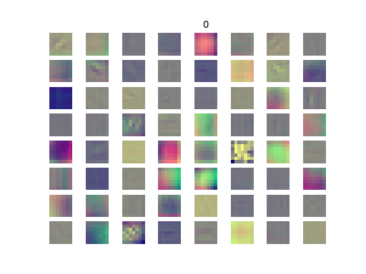

I3D models transfered from Tensorflow to PyTorch
================================================

This repo contains several scripts that allow to transfer the weights from the tensorflow implementation of I3D from the paper [*Quo Vadis, Action Recognition? A New Model and the Kinetics Dataset*](https://arxiv.org/abs/1705.07750) by Joao Carreira and Andrew Zisserman to PyTorch.

The original (and official!) tensorflow code can be found [here](https://github.com/deepmind/kinetics-i3d/).

> 将tensorflow的代码转换为pytorch：

The heart of the transfer is the `i3d_tf_to_pt.py` script

- **rgb checkpoint weight:** Launch it with `python i3d_tf_to_pt.py --rgb` to generate the rgb checkpoint weight pretrained from ImageNet inflated initialization.
- **flow weights:** To generate the flow weights, use `python i3d_tf_to_pt.py --flow`.

- **two stream:** You can also generate both in one run by using both flags simultaneously `python i3d_tf_to_pt.py --rgb --flow`.

Note:

* that the master version requires **PyTorch 0.3** as it relies on the recent addition of ConstantPad3d that has been included in this latest release.
* If you want to use pytorch 0.2 checkout the branch pytorch-02 which contains a simplified model with even padding on all sides (and the corresponding pytorch weight checkpoints).
* The difference is that the 'SAME' option for padding in tensorflow allows it to pad unevenly both sides of a dimension, an effect reproduced on the master branch.

This simpler model produces scores a bit closer to the original tensorflow model on the demo sample and is also a bit faster.

## Demo

There is a slight drift in the weights that impacts the predictions, however, it seems to only marginally affect the final predictions, and therefore, the converted weights should serve as a valid initialization for further finetuning.

This can be observed by evaluating the same sample as the [original implementation](https://github.com/deepmind/kinetics-i3d/).

For a demo, launch `python i3d_pt_demo.py --rgb --flow`.
This script will print the scores produced by the pytorch model.

Pytorch Flow + RGB predictions:
```
1.0          44.53513 playing cricket
1.432034e-09 24.17096 hurling (sport)
4.385328e-10 22.98754 catching or throwing baseball
1.675852e-10 22.02560 catching or throwing softball
1.113020e-10 21.61636 hitting baseball
9.361596e-12 19.14072 playing tennis
```

Tensorflow Flow + RGB predictions:
```
1.0         41.8137 playing cricket
1.49717e-09 21.4943 hurling sport
3.84311e-10 20.1341 catching or throwing baseball
1.54923e-10 19.2256 catching or throwing softball
1.13601e-10 18.9153 hitting baseball
8.80112e-11 18.6601 playing tennis
```


PyTorch RGB predictions:
```
[playing cricket]: 9.999987E-01
[playing kickball]: 4.187616E-07
[catching or throwing baseball]: 3.255321E-07
[catching or throwing softball]: 1.335190E-07
[shooting goal (soccer)]: 8.081449E-08
```

Tensorflow RGB predictions:
```
[playing cricket]: 0.999997
[playing kickball]: 1.33535e-06
[catching or throwing baseball]: 4.55313e-07
[shooting goal (soccer)]: 3.14343e-07
[catching or throwing softball]: 1.92433e-07
```

PyTorch Flow predictions:
```
[playing cricket]: 9.365287E-01
[hurling (sport)]: 5.201872E-02
[playing squash or racquetball]: 3.165054E-03
[playing tennis]: 2.550464E-03
[hitting baseball]: 1.729896E-03
```

Tensorflow Flow predictions:
```
[playing cricket]: 0.928604
[hurling (sport)]: 0.0406825
[playing tennis]: 0.00415417
[playing squash or racquetbal]: 0.00247407
[hitting baseball]: 0.00138002
```

## Time profiling时间分析

To time the forward and backward passes, you can install [kernprof](https://github.com/rkern/line_profiler), 

`pip install line_profiler`

an efficient line profiler, and then launch

`kernprof -lv i3d_pt_profiling.py --frame_nb 16`

对程序运行的时间分析结果output：

```python
Wrote profile results to i3d_pt_profiling.py.lprof
Timer unit: 1e-06 s

Total time: 1.3802 s
File: i3d_pt_profiling.py
Function: run at line 14

Line #      Hits         Time  Per Hit   % Time  Line Contents
==============================================================
    14                                           @profile
    15                                           def run(model, dataloader, criterion, optimizer, frame_nb):
    16                                               # Load data
    17         5      76823.0  15364.6      5.6      for i, (input_2d, target) in enumerate(dataloader):
    18         4         10.0      2.5      0.0          optimizer.zero_grad
    19                                                   # Prepare data for pytorch forward pass
    20         4      51171.0  12792.8      3.7          input_3d = input_2d.clone().unsqueeze(2).repeat(1, 1, frame_nb, 1, 1)
    21         4     175257.0  43814.2     12.7          input_3d_var = torch.autograd.Variable(input_3d.cuda())
    22                                           
    23                                                   # Pytorch forward pass
    24         4     852814.0 213203.5     61.8          out_pt, _ = model(input_3d_var)
    25         4      99024.0  24756.0      7.2          loss = criterion(out_pt, torch.ones_like(out_pt))
    26         4      80792.0  20198.0      5.9          loss.backward()
    27         4      44314.0  11078.5      3.2          optimizer.step()

```

This launches a basic pytorch training script on a dummy dataset（假的数据集） that consists of replicated images as spatio-temporal inputs.

On my GeForce GTX TITAN Black (6Giga) a forward+backward pass takes roughly 0.25-0.3 seconds.


## Some visualizations

Visualization of the weights and matching activations for the first convolutions

### RGB


**Weights**


**Activations**


## Flow


**Weights**



**Activations**


