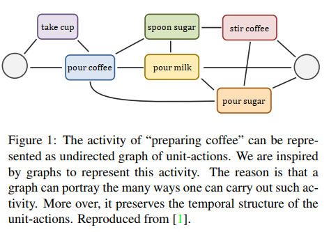
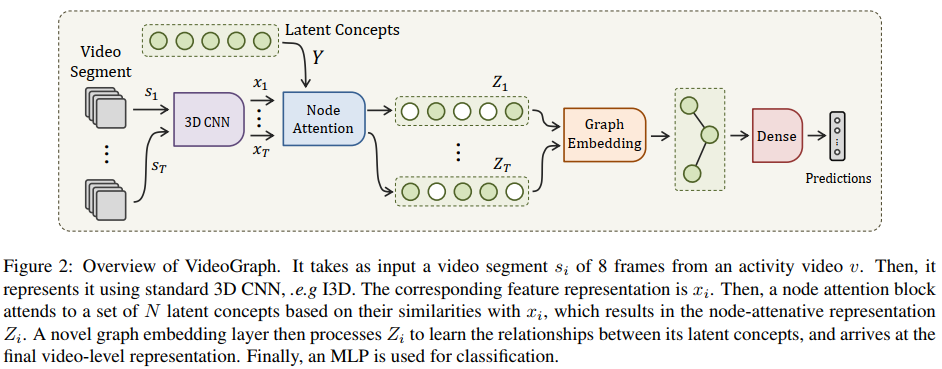
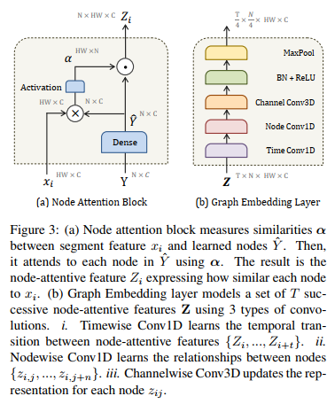
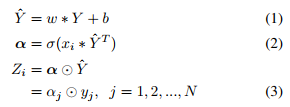

VideoGraph: Recognizing Minutes-Long Human Activities in Videos  

# Idea

- 一个复杂的动作是由多个基本的单元动作组成
- 虽然同一动作有很大的不同，但存在一个潜在的整体的时间结构
- 通过建立图结构来学习这种潜在的关系

# Method

## LSTM和3D CNN缺点：

- 活动时间太长
- 同一种动作有着很大的不同：例如：煮咖啡，有多个路径可以得到最终的咖啡

# VideoGraph  

>- 虽然有很大的不同,但是**整体的时间结构还是有的.**
>- 采用基于图的表示方法:保留时间结构,**可以处理更长时间的动作**.

> 采帧方法：随机采T段，每段选择连续的8帧

## 目标：构建人类活动的无向图$G = (N,E)$

- N：表示活动中的关键的单个动作（unit-actions）
- edges：简单动作之间的时序关系

## 学习图结点nodes

### Node Attention Block

### 公式表述

### 内部组件解释

复杂动作由多个单元简单动作组成，将简单的单元动作作为节点nodes

如何将产生的特征$x_i$与节点`Y`相关联？

- `node attention block`来进行关联：

  - 得到$x_1$: $s_1->x_1 (8\times H \times W \times C  -> 1\times 7\times 7\times 1024)$,$s_i$是第i段视频
  
  - 是一组潜在特征，也是N个节点
  
- $MLP$操作：增加可学习性
  
- $dot product$操作：使用$\softmax()$增加非线性，用来计算每个视频段特征$x_i$与单元动作$Y$之间的关联度。
  
    权重计算意义的解释：
  
    
  
    
  
  > - 一个小问题：Y是如何产生的？
  >
  >   Y是随机产生。`centroids = np.random.rand(n, dim)`

## Learning The Graph Edges  学习图的边

### Graph Embedding Layer  

使用图嵌入层来学习两个信息：

- `Timewise Conv1D:`单元动作之间的时间上的迁移信息
- `Nodewise Conv1D:` 节点之间的关联性

# 实验：

## 在charades数据集上的性能

## VideoGraph节点的学习过程可视化

## 分类实例可视化：

