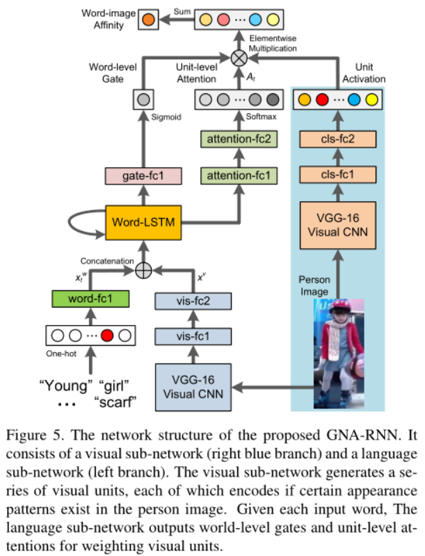

[TOC]

# 基本任务：

- person RE-ID: 使用图片搜图片
- person search：使用文本搜图片

# 框架图


# ViLBERT: Pretraining Task-Agnostic Visiolinguistic Representations for Vision-and-Language Tasks


- 数据集： Visual Genome dataset

- 任务：文本搜索图片

- 视觉特征的提取：

  - 

  - ## [30]Bottom-Up and Top-Down Attention for Image Captioning and Visual Question Answering 

    - 视觉特征提取的方法：

    

    - 模型框架：

      

  - 

  

# Dual-Path Convolutional Image-Text Embeddings with Instance Loss


- 视觉特征的提取：

  - 之前的任务：

    

  - 这篇文章中，先在ImageNet上进行预训练，之后再进行微调。

  

  - 调整策略：

    

  - 这个貌似任务是挺匹配的，但是代码是matlab的

# Improving Text-based Person Search by Spatial Matching and Adaptive Threshold 


- 视觉特征的提取：

  - Vgg16model：

    

# Person Search with Natural Language Description



# Re-ranking Person Re-identification with k-reciprocal Encoding 


- 视觉特征提取：

  - 
  - 目前是使用了这里的权重效果均为0.

  # Cascade Attention Network for Person Search: Both Image and Text-Image Similarity Selection （AAAI2019）

  

  ## 视觉特征提取：

  

  # Faster RCNN代码分析

  
  
  
  
  - backbone：resnet
  
    - 101：
  
      ```python
      layer {
          bottom: "res4b21"
          bottom: "res4b22_branch2c"
          top: "res4b22"
          name: "res4b22"
          type: "Eltwise"
      }
    
      layer {
        bottom: "res4b22"
          top: "res4b22"
        name: "res4b22_relu"
          type: "ReLU"
    }
      ```
  
      最后一层的输出为`res4b22_relu`
  
  - RPN
  
    - 开始部分层：
  
    ```python
    layer {
      name: "rpn_conv/3x3"
      type: "Convolution"
      bottom: "res4b22"
      top: "rpn/output"
      param { lr_mult: 1.0 }
      param { lr_mult: 2.0 }
    convolution_param {
        num_output: 512
      kernel_size: 3 pad: 1 stride: 1
        weight_filler { type: "gaussian" std: 0.01 }
      bias_filler { type: "constant" value: 0 }
      }
    }
    ```
  
    输入：res4b22
  
    - 最后一部分：
  
      ```python
      layer {
        name: "rpn_bbox_pred"
        type: "Convolution"
        bottom: "rpn/output"
        top: "rpn_bbox_pred"
        param { lr_mult: 1.0 }
        param { lr_mult: 2.0 }
        convolution_param {
          num_output: 48   # 4 * 12(anchors)
          kernel_size: 1 pad: 0 stride: 1
          weight_filler { type: "gaussian" std: 0.01 }
          bias_filler { type: "constant" value: 0 }
        }
      }
    layer {
         bottom: "rpn_cls_score"
       top: "rpn_cls_score_reshape"
         name: "rpn_cls_score_reshape"
       type: "Reshape"
         reshape_param { shape { dim: 0 dim: 2 dim: -1 dim: 0 } }
    }
      ```
  
      输出：`rpn_cls_score_reshape`，`rpn_bbox_pred`
  
  - ROI
  
    - 开始部分层：
  
  ```python
    layer {
    name: "rpn_cls_prob"
      type: "Softmax"
    bottom: "rpn_cls_score_reshape"
      top: "rpn_cls_prob"
    }
    ```
  
    输出：rpn_cls_prob
  
    - 最后一部分层：
  
      ```python
      layer {
        name: 'proposal'
        type: 'Python'
        bottom: 'rpn_cls_prob_reshape'
        bottom: 'rpn_bbox_pred'
        bottom: 'im_info'
      top: 'rois'
        python_param {
        module: 'rpn.proposal_layer'
          layer: 'ProposalLayer'
        param_str: "'feat_stride': 16 \n'scales': !!python/tuple [4, 8, 16, 32]"
        }
    }
      ```
  
      输出：`rois`
  
  - RCNN
  
    - 开始部分层
  
      ```python
      layer {
        name: "roi_pool5"
        type: "ROIPooling"
        bottom: "res4b22"
        bottom: "rois"
      top: "roipool5"
        roi_pooling_param {
        pooled_w: 14
          pooled_h: 14
          spatial_scale: 0.0625 # 1/16
        }
      }
      ```
  
      输入：`res4b22`，`rois`
  